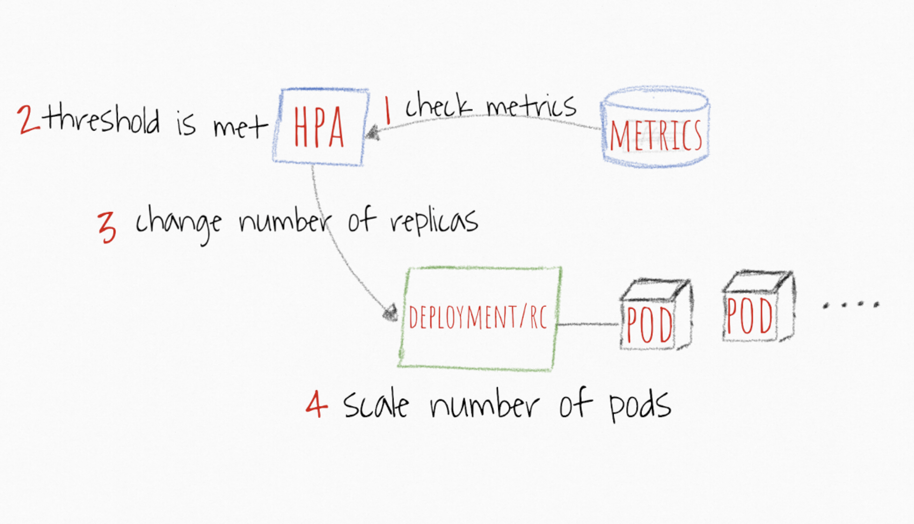

# Workshop 08 - Horizontal Pod Autoscaling (HPA)


# Index
* [Kubernetes Autoscaling Building Blocks](#kubernetes-autoscaling-building-blocks)
* [How does the Horizontal Pod Autoscaler work?](#How-does-the-Horizontal-Pod-Autoscaler-work)
  * [Exercise: HPA](#Exercise:-HPA)

---

Effective kubernetes auto-scaling requires coordination between two layers of scalability: (1) Pods layer autoscalers, this includes Horizontal Pod Autoscaler (HPA) and Vertical Pod Autoscaler (VPA)(aka. "rightsizing" or "autopilot"); both scale available resources for your containers, and (2) cluster level scalability, which managed by the Cluster Autoscaler (CA); it scales up or down the number of nodes inside your cluster.

**Note** this workshop focus only HPA.

---

[Back to Index](#index)

---

# How does the Horizontal Pod Autoscaler work?

The Horizontal Pod Autoscaler automatically scales the number of pods in a replication controller, deployment or replica set based on observed CPU utilization (or, with custom metrics support, on some other application-provided metrics).

The Horizontal Pod Autoscaler is implemented as a Kubernetes API resource and a controller. The resource determines the behavior of the controller. The controller periodically adjusts the number of replicas in a replication controller or deployment to match the observed average CPU utilization to the target specified by user.



 1. HPA continuously checks metrics values you configure during setup AT A DEFAULT 30 SEC intervals
 2. HPA attempts to increase the number of pods If the SPECIFIED threshold is met
 3. HPA mainly updates the number of replicas inside the deployment or replication controller
 4. The Deployment/Replication Controller WOULD THEN roll-out ANY additional needed pods

# Exercise: HPA
**Objectives:** Learn how to use the horizontal pod autoscaling feature and how to configure grafana to fetch pod/node metrics.

1) Start `minikube` with 4 cpu's and 4GB of memory
**Note** the params specified to configure the behavior of the controller manager.

    **Command**

    ```sh
    $ minikube start --cpus=4 --memory 4096 \
    --extra-config=controller-manager.horizontal-pod-autoscaler-downscale-stabilization=5s \
    --extra-config=controller-manager.horizontal-pod-autoscaler-sync-period=5s
    ```

2) Check heapster and metrics server are enabled

    **Command**
    ```sh
    $ minikube addons list | grep enabled
    ```

3) Check metrics pods are `Running`

    **Command**
    ```sh
    $ kubectl get pods --namespace=kube-system | grep heapster
    $ kubectl get pods --namespace=kube-system | grep metrics-server
    ```

4) Check heapster is connected to `influxDB`

    **Command**
    ```sh
    $ kubectl logs -n kube-system $(kubectl get -n kube-system pod --selector=k8s-app=heapster -o jsonpath='{.items..metadata.name}') | grep "k8s"
    ```

5) Check cpu and mem allocation

    **Command**
    ```sh
    $ kubectl describe nodes
    $ kubectl top node
    $ kubectl top pod -n kube-system
    ```

6) Open grafana 

    **Command**
    ```sh
    $ minikube addons open heapster
    ```

7) configure grafana UI (optional)

    - https://grafana.com/dashboards/3646
    - https://grafana.com/dashboards/3649

8) Check previous values (request, usage) in Grafana

9) Deploy example app

    **Command**

    ```sh
    kubectl apply -Rf workshop-08/manifests/app
    ```

10) wait until pod is Running (1 replica is running)

    **Command**

    ```sh
    kubectl get pods --show-labels --watch
    ```

11) Deploy `HPA`

    **Command**

    ```sh
    kubectl apply -f workshop-08/manifests/hpa/hpa.yaml
    ```

12) open new tab and run the following

    **Command**

    ```sh
    $ kubectl get hpa -w
    ```

13) open new tab and run the following (check 5 replicas running)

    **Command**

    ```sh
    $ kubectl get deployment php-apache -w
    ```

14) open new tab and run the following

    **Command**

    ```sh
    $ kubectl run --rm -i --tty load-generator --image=busybox /bin/sh
    # run this
    while true; do wget -q -O- http://php-apache.default.svc.cluster.local; done
    ```

15) Wait for the hpa to trigger (observe `hpa` and `deployment`)

16) Stop the loader and check how the deployment scales down to 5

---

[Back to Index](#index)

---

[Back to Index](#index)

---
---

# Helpful Resources

* [VPA](https://github.com/kubernetes/community/blob/master/contributors/design-proposals/autoscaling/vertical-pod-autoscaler.md)
* [VPA](https://github.com/kubernetes/autoscaler/tree/master/vertical-pod-autoscaler)
* [cluster-autoscaler](https://github.com/kubernetes/autoscaler/tree/master/cluster-autoscaler)
* [kube-controller-manager](https://kubernetes.io/docs/reference/command-line-tools-reference/kube-controller-manager/)

---

[Back to Index](#index)

---