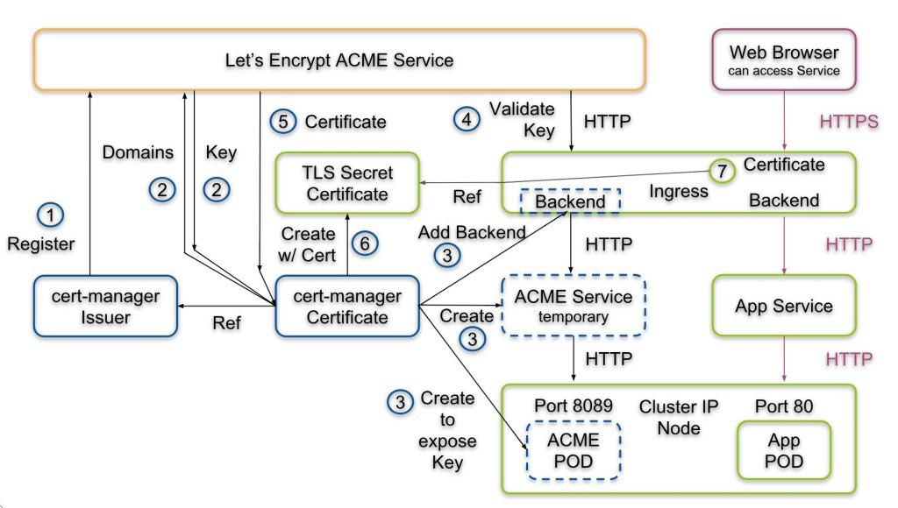

# Workshop 10 - Ingress Controller


# Index
* [What is Ingress?](#what-is-ingress?)
  * [Exercise: Set up Ingress on Minikube with the NGINX Ingress Controller](#Exercise:-Set-up-Ingress-on-minikube-with-the-NGINX-ingress-controller)
  * [Exercise: Create fanout ingress-controlled app](#Exercise:-create-fanout-ingress-controlled-app)
  * [Exercise: Configuring Certificate-Based Authentication with Kubernetes Ingress-Nginx (Manual)](#Exercise:-Configuring-Certificate-Based-Authentication-with-Kubernetes-Ingress-Nginx)
  * [Exercise: Configuring Certificate-Based Authentication with Kubernetes Ingress-Nginx (Cert-Manager)](#Exercise:-Configuring-Certificate-Based-Authentication-with-Kubernetes-Ingress-Nginx-cert-manager)

---

# What is Ingress?

Ingress exposes HTTP and HTTPS routes from outside the cluster to services within the cluster. Traffic routing is controlled by rules defined on the Ingress resource.

```sh
        internet
            |
      [ Ingress ]
      --|-----|--
      [ Services ]
```

You must have an ingress controller to satisfy an Ingress. Only creating an Ingress resource has no effect.

You may need to deploy an ingress controller such as ingress-nginx. There are a number of ingress controllers you may choose from.

---

[Back to Index](#index)

---

## Exercise: Set up Ingress on Minikube with the NGINX Ingress Controller
**Objective** Install the nginx ingress controller in minikube via addon.

---

1. To enable the NGINX Ingress controller, run the following command:

    ```sh
    $ minikube addons enable ingress
    ```

2. Verify that the NGINX Ingress controller is `Running`

    ```sh
    $ kubectl get pods -n kube-system -w | grep ingress
    ```

    **Note**: This can take up to a minute.

---

[Back to Index](#index)

---

## Exercise: Create fanout ingress-controlled app
**Objective** To be able to create a fanout ingress access that redirects traffic between v1 and v2 of an example app.

### Deploy app (v1)

1. Create a Deployment using the following command:

    ```sh
    $ kubectl run web --image=gcr.io/google-samples/hello-app:1.0 --port=8080
    ```

2. Expose the Deployment:

    ```sh
    $ kubectl expose deployment web --target-port=8080 --type=NodePort
    ```
3. Verify the Service is created and is available on a node port:

    ```sh
    $ kubectl get service web
    ```

4. Visit the service via `NodePort`

    ```sh
    $ minikube service web --url
    ```

#### Create an Ingress resource

Let´s send traffic to your Service via hello-world.info.

1. Create the ingress

    **Command**

    ```sh
    $ kubectl apply -f workshop-10/manifests/example-ingress.yaml
    ```
2. Verify the IP address is set

    **Command**

    ```sh
    $ kubectl get ingress
    ```

3. Add the following line to the bottom of the /etc/hosts file.

    ```sh
    $ echo "$(minikube ip) hello-world.info" | sudo tee -a /etc/hosts
    ```

4. Test the ingress

    ```sh
    $ curl hello-world.info
    ```

### Deploy app (v2)

1. Create a v2 Deployment using the following command:
  
    ```sh
    $ kubectl run web2 --image=gcr.io/google-samples/hello-app:2.0 --port=8080
    ```

2. Expose the Deployment:

    ```sh
    $ kubectl expose deployment web2 --target-port=8080 --type=NodePort
     ```

### Update Ingress

1. Edit the existing `workshop-10/manifests/example-ingress.yaml` and add the following lines:

    ```yaml
    - path: /v2/*
       backend:
         serviceName: web2
         servicePort: 8080
    ```

2. Apply the changes:

      ```sh
      $ kubectl apply -f workshop-10/manifests/example-ingress.yaml
      ```

3. Test the accesses:

    ```sh
    $ curl hello-world.info
    ```

    ```sh
    $ curl hello-world.info/v2
    ```

## Clean up

  ```sh
  $ kubectl delete all -lrun=web
  $ kubectl delete all -lrun=web2
  $ kubectl delete ingress fanout-ingress
  ```
---

[Back to Index](#index)

---

## Exercise: Configuring Certificate-Based Authentication with Kubernetes Ingress-Nginx

SSL authentication (server --> client)

In SSL authentication, the client is presented with a server’s certificate, the client computer might try to match the server’s CA against the client’s list of trusted CAs. If the issuing CA is trusted, the client will verify that the certificate is authentic and has not been tampered with.


### Setting Up Authentication

For this example we will be creating self-signed certificates.

**Objective** Review some certificates management concepts. Manually create the server certificates, create a K8s secret with those andb attach it to the nginx ingress.

 As a simple introduction, here are a couple of terms it would be useful to know:

- **CommonName(CN)**: Identifies the hostname or owner associated with the certificate.
- **Server Certificate**: A Certificate used to identify the server. The `CN` here is the hostname of the server. The Server Certificate is valid only if it is installed on a server where the hostname matches the CN.
  ```sh
  # Generate the Server Key and Certificate
  $ openssl req -x509 -sha256 -nodes -days 365 -newkey rsa:2048 -keyout tls.key -out tls.crt -subj "/CN=hello-world.info"
  ```

  We should see this:

  ```sh
  Generating a 2048 bit RSA private key
  ....+++
  .....+++
  writing new private key to 'tls.key'
  ```

  And have these files created:

  ```sh
  .
  ├── tls.crt
  └── tls.key
  ```

### Creating the Kubernetes Secrets

We must store the certificates generated above in a Kubernetes `secret` in order to use them in our Ingress-NGINX controller.

```sh
$ kubectl create secret tls tls-secret --key tls.key --cert tls.crt
```

Check is being properly created:

```sh
$ kubectl get secret tls-secret
```

### Deploy app


1. Deploy previous sample app

    **Command**
    ```sh
    $ kubectl run web --image=gcr.io/google-samples/hello-app:2.0 --port=8080
    ```
2. Expose the `deployment`:

    ```sh
    $ kubectl expose deployment web --target-port=8080
     ```

3. Setup the Ingress Rules

    **Note** Make sure `hello-world.info` is already reachable via `/etc/hosts`

    Deploy the following:

    **Command**

    ```sh 
      $ kubectl apply -f workshop-10/manifests/certs/ingress.yaml
      ```

    This allows us to access the service `web` via `https://hello-world.info/`.

    - TLS is enabled and it is using the tls.key and tls.crt provided in the tls-secret `secret`.

    Check is properly created:

    **Command**
    ```sh
    kubectl get ing web-ingress-tls
    
    NAME          HOSTS              ADDRESS   PORTS     AGE
    web-ingress-tls   hello-world.info             80, 443   24s
    ```

### Clean up

TODO!!!!!!

**Command**

```sh
$

```

---

[Back to Index](#index)

---

## Exercise: Configuring Certificate-Based Authentication with Kubernetes Ingress-Nginx-Cert-Manager

**Objectives** Following up the previous example in this occasion with are setting up the certificate attachment to the nginx ingress automatically via [cert-manager](https://github.com/jetstack/cert-manager)

cert-manager is a native Kubernetes certificate management controller. It can help with issuing certificates from a variety of sources, such as Let’s Encrypt, HashiCorp Vault, Venafi, a simple signing keypair, or self signed.

It will ensure certificates are valid and up to date, and attempt to renew certificates at a configured time before expiry.


The goal is to automatically provision a trusted certificate to the ingress controller, which in turn will use the certificate to terminate encrypted HTTPS connections from the Internet. This is shown in Magenta on the right part of the figure.



However, several steps have to be performed to get such a certificate:

1. the cert-manager issuer registers with the Let’s Encrypt service.
2. Upon successful registration, the cert-manager certificate object will send a list of domains. Let’s encrypt will send a URL path and a key to the cert-manager certificate object
3. Immediately thereafter, the certification object creates three temporary objects for the purpose of ACME validation:
   - an ACME POD listening on port 8089
   - an ACME  Service accessing the POD
   - a backend entry in the ingress controller that points to port 8090
4. Once, the three temporary objects are fully functional, the Let’s Encrypt ACME service can access the POD on the domain and URL and will receive the key from the POD. With that, Let’s Encrypt has validated that the person, who has requested a certificate signature has full control of the domain listed in the certificate.
5. Thus, the domain valid and the ACME service will send a signed certificate to the certificate object.
6. After receipt of the signed certificate, the cert-manager certificate object will encapsulate the certificate and private key into a TLS secret.
7. The ingress controller now can access the certificate and key and use it to terminate HTTPS sessions from the Internet.

    For housekeeping purposes, the certificate object will delete the POD, the Service and the backend entry in the ingress controller, once it has received the signed certificate.


**Note** Make sure ingress in enabled in minikube

```sh
$ minikube addons list | grep enabled
```

**Note** Make sure helm is installed

```sh
$ helm version
```

### Install cert manager jetstack

1. Install the CustomResourceDefinition resources separately

    ```sh
    $ kubectl apply -f https://raw.githubusercontent.com/jetstack/cert-manager/release-0.8/deploy/manifests/00-crds.yaml
    ```

2. Check crd's are installed

    ```sh
    $ kubectl get crd

    NAME                                CREATED AT
    certificates.certmanager.k8s.io     2019-06-20T09:08:21Z
    challenges.certmanager.k8s.io       2019-06-20T09:08:21Z
    clusterissuers.certmanager.k8s.io   2019-06-20T09:08:21Z
    issuers.certmanager.k8s.io          2019-06-20T09:08:21Z
    orders.certmanager.k8s.io           2019-06-20T09:08:21Z
    ```

2. Create the namespace for cert-manager

    ```sh
    $ kubectl create namespace cert-manager
    ```
3. Label the cert-manager namespace to disable resource validation
    ```sh
    $ kubectl label namespace cert-manager certmanager.k8s.io/disable-validation=true
    ```
4. Add the Jetstack Helm repository
    ```sh
    $ helm repo add jetstack https://charts.jetstack.io
    ````
5. Update your local Helm chart repository cache

    ```sh
    $ helm repo update
    ```
6. Install the cert-manager Helm chart
    ```sh
    $ helm install \
        --name cert-manager \
        --namespace cert-manager \
        --version v0.8.1 \
        jetstack/cert-manager
    ```
7. Verifying the installation

    ```sh
    $ kubectl get pods --namespace cert-manager -w

    NAME                                       READY   STATUS    RESTARTS   AGE
    cert-manager-cainjector-5dfd7c584d-fvxmv   1/1     Running   0          51s
    cert-manager-dcbb6f5b9-skb8z               1/1     Running   0          51s
    cert-manager-webhook-f6f965745-7v5vc       1/1     Running   0          51s

    ```

### Create Cluster Issuer

Before you can begin issuing certificates, you must configure at least one `Issuer` or `ClusterIssuer` resource in your cluster.

These represent a certificate authority from which signed x509 certificates can be obtained, such as Let’s Encrypt, or your own signing key pair stored in a Kubernetes Secret resource. They are referenced by Certificate resources in order to request certificates from them.

An `Issuer` is scoped to a *single namespace*, and can only fulfill Certificate resources within its own namespace. This is useful in a multi-tenant environment where multiple teams or independent parties operate within a single cluster.

On the other hand, a `ClusterIssuer` is a *cluster wide* version of an Issuer. It is able to be referenced by Certificate resources in any namespace.

1. Creating a basic staging ACME ClusterIssuer (important to use a valid email)

    ```yaml
    apiVersion: certmanager.k8s.io/v1alpha1
    kind: ClusterIssuer
    metadata:
      name: letsencrypt-staging
    spec:
      acme:
        server: https://acme-staging-v02.api.letsencrypt.org/directory
        # You must replace this email address with your own.
        # Let's Encrypt will use this to contact you about expiring
        # certificates, and issues related to your account.
        email: change-me@mail.com
        privateKeySecretRef:
          # Secret resource used to store the account's private key.
          name: letsencrypt-staging
        http01: {}
    ```

    or via the following **command**

    ```sh
    $ kubectl apply -f workshop-10/manifests/cert-manager/cluster-issuer.yaml
    ```

    Check is properly created

    **Command**

    ```sh
    $ kubectl describe clusterissuer letsencrypt-staging

    ...
    Status:
    Acme:
        Uri:  https://acme-staging-v02.api.letsencrypt.org/acme/acct/9663780
    Conditions:
        Last Transition Time:  2019-06-20T10:27:50Z
        Message:               The ACME account was registered with the ACME server
        Reason:                ACMEAccountRegistered
        Status:                True
        Type:                  Ready
        Events:                    <none>
    ```

### Create Application and Ingress Entry

1. Deploy app
    ```sh
    $ kubectl create deployment nginx-letsencrypt-demo --image=nginxdemos/hello
    # output: 'deployment.apps/nginx-letsencrypt-demo created'

    $ kubectl expose deployment nginx-letsencrypt-demo --port=80
    # output: 'service/nginx-letsencrypt-demo exposed'
    ```

2. Deploy ingress

    Important here to make sure that ingress annotation `certmanager.k8s.io/cluster-issuer: letsencrypt-staging` matches cluster issuer `name: letsencrypt-staging` and ingress `secretName:letsencrypt-staging` matches clusterissuer `privateKeySecretRef: name: letsencrypt-staging`

    ```yaml
    apiVersion: extensions/v1beta1
    kind: Ingress
    metadata:
      name: ingress-resource
      labels:
        app: nginx
      annotations:
        certmanager.k8s.io/cluster-issuer: letsencrypt-staging
    spec:
      tls:
      - hosts:
        - nginx.example.com
        secretName: letsencrypt-staging
      rules:
      - host: nginx.example.com
        http:
          paths:
          - backend:
              serviceName: nginx-letsencrypt-demo
              servicePort: 80
    ```

    or via the following **command**

    ```sh
    $ kubectl apply -f workshop-10/manifests/cert-manager/ingress-resource.yaml
    ```

    Check is properly deployed

    ```sh
    $ kubectl describe ing ingress-resource

    ...

    Events:
        Type    Reason             Age    From                      Message
        ----    ------             ----   ----                      -------
        Normal  CREATE             2m57s  nginx-ingress-controller  Ingress default/ingress-resource
        Normal  CreateCertificate  2m56s  cert-manager              Successfully created Certificate "letsencrypt-staging"
        Normal  UPDATE             2m51s  nginx-ingress-controller  Ingress default/ingress-resource
    ```

    Let´s check that this ingress deployment has generated a secret automatically for us (letsencrypt-staging)

    **Command**
    ```sh
    $ kubectl get secrets

    ...
    default-token-flwg6   kubernetes.io/service-account-token   3      110m
    letsencrypt-staging   kubernetes.io/tls                     3      10s
    ```

    Check created certificate

    ```sh
    $ kubectl get certificates
    ...
    letsencrypt-staging   False   letsencrypt-staging   50s
    ```

    ```sh
    $ kubectl describe certificates letsencrypt-staging
    ...
    Events:
        Type     Reason              Age   From          Message
        ----     ------              ----  ----          -------
        Normal   Generated           2m9s  cert-manager  Generated new private key
        Normal   GenerateSelfSigned  2m9s  cert-manager  Generated temporary self signed certificate
        Normal   OrderCreated        2m9s  cert-manager  Created Order resource "letsencrypt-staging-230902236"
    ```

### Add DNS entry

```sh
echo "$(minikube ip) nginx.example.com" | sudo tee -a /etc/hosts
```

Check https is working.

### Swicth to prod certificates

1. Creating a prod ACME ClusterIssuer (important to use a valid email)

    ```yaml
    apiVersion: certmanager.k8s.io/v1alpha1
    kind: ClusterIssuer
    metadata:
      name: letsencrypt-prod
    spec:
      acme:
        # The ACME server URL
        server: https://acme-v02.api.letsencrypt.org/directory
        # Email address used for ACME registration
        email: change-me@mail.com
        # Name of a secret used to store the ACME account private key
        privateKeySecretRef:
          name: letsencrypt-prod
        # Enable the HTTP-01 challenge provider
        http01: {}
    ```

    or via the following **command**

    ```sh
    $ kubectl apply -f workshop-10/manifests/cert-manager/cluster-issuer-prod.yaml
    ```

    Check is properly created

    **Command**

    ```sh
    $ kubectl describe clusterissuer letsencrypt-prod

    ...
    Status:
      Acme:
        Uri:  https://acme-v02.api.letsencrypt.org/acme/acct/59647885
      Conditions:
        Last Transition Time:  2019-06-20T13:14:29Z
        Message:               The ACME account was registered with the ACME server
        Reason:                ACMEAccountRegistered
        Status:                True
        Type:                  Ready
    Events:                    <none>
    ```

2. Update ingress (prod)

    Important here to make sure that ingress annotation `certmanager.k8s.io/cluster-issuer: letsencrypt-prod` matches cluster issuer `name: letsencrypt-prod` and ingress `secretName:letsencrypt-prod` matches clusterissuer `privateKeySecretRef: name: letsencrypt-prod`

    ```yaml
    apiVersion: extensions/v1beta1
    kind: Ingress
    metadata:
      name: ingress-resource
      labels:
        app: nginx
      annotations:
        certmanager.k8s.io/cluster-issuer: letsencrypt-prod
    spec:
      tls:
      - hosts:
        - nginx.example.com
        secretName: letsencrypt-prod
      rules:
      - host: nginx.example.com
        http:
          paths:
          - backend:
              serviceName: nginx-letsencrypt-demo
              servicePort: 80
    ```

    or via the following **command**

    ```sh
    $ kubectl apply -f workshop-10/manifests/cert-manager/ingress-resource-prod.yaml
    ```

    Check is properly deployed

    ```sh
    $ kubectl describe ing ingress-resource

    ...

    Events:
      Type    Reason             Age               From                      Message
      ----    ------             ----              ----                      -------
      Normal  CREATE             27m               nginx-ingress-controller  Ingress default/ingress-resource
      Normal  CreateCertificate  27m               cert-manager              Successfully created Certificate "letsencrypt-staging"
      Normal  UpdateCertificate  21m               cert-manager              Successfully updated Certificate "letsencrypt-staging"
      Normal  UPDATE             2s (x3 over 26m)  nginx-ingress-controller  Ingress default/ingress-resource
      Normal  CreateCertificate  2s                cert-manager              Successfully created Certificate "letsencrypt-prod"
    ```

    Let´s check that this ingress deployment has generated a secret automatically for us (letsencrypt-prod)

    **Command**
    ```sh
    $ kubectl get secrets

    ...
    default-token-flwg6   kubernetes.io/service-account-token   3      110m
    letsencrypt-prod      kubernetes.io/tls                     3      47s
    letsencrypt-staging   kubernetes.io/tls                     3      27m
    ```

    Check created certificate

    ```sh
    $ kubectl get certificates
    ...
    NAME                  READY   SECRET                AGE
    letsencrypt-prod      False   letsencrypt-prod      77s
    letsencrypt-staging   False   letsencrypt-staging   28m
    ```

    ```sh
    $ kubectl describe certificates letsencrypt-prod
    ...
    Events:
        Type     Reason              Age   From          Message
        ----     ------              ----  ----          -------
        Normal   Generated           2m9s  cert-manager  Generated new private key
        Normal   GenerateSelfSigned  2m9s  cert-manager  Generated temporary self signed certificate
        Normal   OrderCreated        2m9s  cert-manager  Created Order resource "letsencrypt-staging-230902236"
        Normal   Generated           2m5s  cert-manager  Generated new private key
        Normal   GenerateSelfSigned  2m5s  cert-manager  Generated temporary self signed certificate
        Normal   OrderCreated        2m5s  cert-manager  Created Order resource "letsencrypt-prod-1706045550"
    ```

# Helpful Resources

* [Ingress](https://kubernetes.io/docs/concepts/services-networking/ingress/#types-of-ingress)
* [Nginx Ingress Controller](https://github.com/kubernetes/ingress-nginx)
* [Nginx Ingress Controller example](https://github.com/kubernetes/ingress-nginx/tree/master/docs/examples)
* [Nginx tls termination](https://kubernetes.github.io/ingress-nginx/examples/tls-termination/)
* [Cert Manager K8s](https://github.com/jetstack/cert-manager)

---

[Back to Index](#index)

---